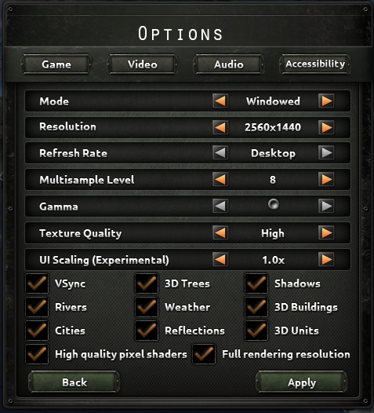
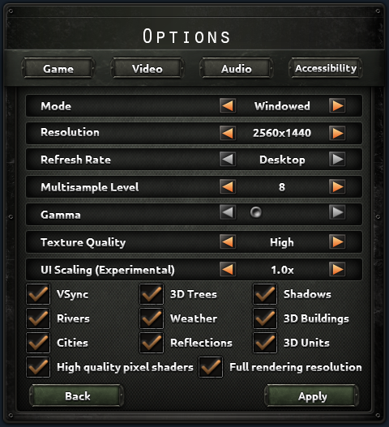
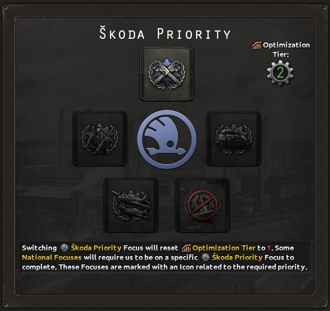
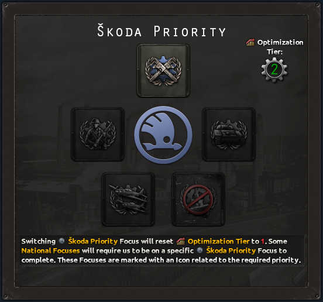
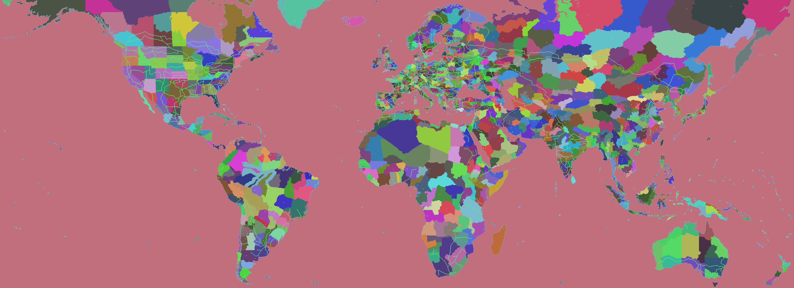
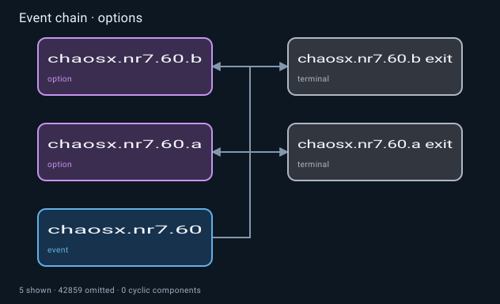

# HOI4 Agent Tools

HOI4 Agent Tools is an MCP server for coding agents to understand Hearts of Iron IV event chains, decisions, cross-system dependencies, technology systems, AI weights, and MTTH timing and to inspect, create, or clean up focus trees, scripted GUIs, and maps. It produces source-linked structural and visual evidence that agents can use inside a larger modding workflow.

## What it does

- Focus trees: inspect structure and references, render layouts, create trees, and reorganize existing branches.
- Scripted GUIs: trace GUI, GFX, scripted-GUI, and localisation links; render value-driven variants, dynamic country flags, inline text icons, states, resolutions, hierarchy, and click regions; diagnose alignment, visibility, clipping, panel containment, and button-label centering; create or repair interface source.
- Maps: navigate the complete rendered map by ID or localised name; inspect provinces, states, regions, adjacency, supply, railways, and positions; create states and provinces; change IDs; and repair connected map data.
- Event chains: scan definitions and call sites, trace routes and state flow, lint references, render graphs, and compare revisions without editing event source.
- Cross-system impact and decisions: trace definitions and consumers across source systems, evaluate declared actor and target scenarios, inspect costs and mission paths, and compare in-memory proposals.
- Technology trees: reconstruct technology and doctrine paths, folder layouts, unlocks, bonuses, grants, metadata, assets, and structural changes.
- AI and MTTH: evaluate weighted choices and timing across explicit scenarios, bind special scope chains, enumerate dynamic target pools, sweep uncertain inputs, simulate distributions, compare patches, and analyze declared stateful pools.
- Local references: search and read cited offline wiki pages, installed game documentation, optional script documentation, and exact source symbols without loading whole manuals into the conversation.

## Real results

The examples use real installed vanilla and Chaos Redux source, supplied game captures, and explicit reproducible display scenarios. They demonstrate source-backed review, not a claim of 99.9% whole-image accuracy. Images, source revisions, hashes, and known differences are in [Visual comparisons](docs/visual-comparisons.md) and [Interface examples](docs/gui-comparisons.md).

| Options Video in game                                                          | Options Video from the MCP renderer                                                                |
| ------------------------------------------------------------------------------ | -------------------------------------------------------------------------------------------------- |
|  |  |

| Škoda Priority in game                                                           | Škoda Priority from the MCP renderer                                                                 |
| -------------------------------------------------------------------------------- | ---------------------------------------------------------------------------------------------------- |
|  |  |

The interface gallery also includes Chaos Redux Settings, Event Log, and Chaos Meter, plus populated vanilla decision and occupation templates. Their manifests separate source-defined layout from declared native runtime fields.

The other workbenches return complete source-linked layouts and catalogs rather than prose-only summaries.

For the supplied focus and technology game captures beside current-source MCP renders, see [Visual examples and comparison limits](https://github.com/klimPaskov/hoi4-agent-tools/blob/main/docs/visual-comparisons.md). These comparisons do not establish 99.9% whole-image accuracy.

| Fury focus tree from Chaos Redux                                                          | Infantry technology folder from Chaos Redux and vanilla                                                |
| ----------------------------------------------------------------------------------------- | ------------------------------------------------------------------------------------------------------ |
|  |  |

| Map                                                                              | Event options                                                                                      |
| -------------------------------------------------------------------------------- | -------------------------------------------------------------------------------------------------- |
|  |  |

These two views retain native output resolution. Their [source manifest](docs/images/comparisons/source/manifest.json) records the map revision and the exact Fury event used for the option view. The event renderer's omitted-node count includes the rest of the workspace graph outside that selection.

## Use from a coding agent

Requires Node.js 22.19 or later in the Node 22 line, or Node.js 24.

```bash
npm install --global hoi4-agent-tools@latest
```

```toml
[mcp_servers.hoi4_agent_tools]
command = "hoi4-agent-tools.cmd"
```

On non-Windows systems, use `hoi4-agent-tools` as the command. Agentic HOI4 repositories can include these steps in their agent template so the coding agent installs and registers the server itself; manual installation is not required in that workflow. Once connected, the server follows the active mod supplied by the client and the agent can call its HOI4 tools directly.

## Tools

| Tool                        | Purpose                                                                                   |
| --------------------------- | ----------------------------------------------------------------------------------------- |
| `hoi4.focus_inspect`        | Read focus trees, continuous-focus placement, and structural or reference problems.       |
| `hoi4.focus_render`         | Produce fast HTML, SVG, JSON, and source-linked layout artifacts.                         |
| `hoi4.focus_raster`         | Produce a high-fidelity PNG review with decoded source icons.                             |
| `hoi4.focus_rewrite`        | Create or update a focus tree.                                                            |
| `hoi4.gui_inspect`          | Read a scripted GUI and its linked assets and logic.                                      |
| `hoi4.gui_render`           | Render generated and explicit GUI scenarios, states, resolutions, and layout diagnostics. |
| `hoi4.gui_rewrite`          | Create or update a GUI source package.                                                    |
| `hoi4.map_inspect`          | Search, click, navigate, and inspect the complete rendered map and its linked data.       |
| `hoi4.map_render`           | Render full-map layers, overlays, names, IDs, coordinates, and source-linked catalogs.    |
| `hoi4.map_rewrite`          | Create or update states, provinces, IDs, networks, positions, and connected map data.     |
| `hoi4.reference_context`    | Get compact, cited wiki and installed documentation pointers for a modding surface.       |
| `hoi4.reference_search`     | Search bounded local documentation sections.                                              |
| `hoi4.reference_read`       | Read one revision-bound section, with line continuation.                                  |
| `hoi4.source_lookup`        | Find exact definitions, overrides, usages, and narrow source blocks.                      |
| `hoi4.event_inspect`        | Scan, trace, explain, lint, or assess event chains and their state flow.                  |
| `hoi4.event_render`         | Render source-linked event routes, options, timing, state, scope, and unresolved edges.   |
| `hoi4.event_compare`        | Compare event-chain topology and diagnostics between revisions.                           |
| `hoi4.impact_inspect`       | Trace symbol and changed-file consumers across source systems and compare proposals.      |
| `hoi4.decision_inspect`     | Inventory and evaluate decisions or missions under declared scenarios and source changes. |
| `hoi4.mechanic_test`        | Execute bounded source effects on a copied declared scenario and check assertions.        |
| `hoi4.package_check`        | Check declarative package definitions, calls, registrations, assets, and case links.      |
| `hoi4.scenario_test`        | Run named source and domain cases in resumable, revision-bound batches.                   |
| `hoi4.job_inspect`          | Inspect durable background work or retrieve its completed tool result.                    |
| `hoi4.job_cancel`           | Durably request cancellation of authorized background work.                               |
| `hoi4.tech_inspect`         | Scan, trace, explain, lint, and assess technology and doctrine systems.                   |
| `hoi4.tech_render`          | Render source layouts with real item sizes and year guides, plus dependencies and assets. |
| `hoi4.tech_compare`         | Compare technology graphs, placements, references, diagnostics, and source overlays.      |
| `hoi4.probability_inspect`  | Locate weighted logic and discover compatible adapters, candidates, and required inputs.  |
| `hoi4.probability_evaluate` | Evaluate exact values, probabilities, timing, bounds, and unresolved inputs.              |
| `hoi4.probability_sweep`    | Find sensitivity, breakpoints, cliffs, and rank reversals across declared ranges.         |
| `hoi4.probability_simulate` | Run deterministic sampled analysis with confidence and convergence data.                  |
| `hoi4.probability_sequence` | Analyze declared recovery, caps, cooldowns, resets, timers, and terminal states.          |
| `hoi4.probability_compare`  | Attribute AI-weight and MTTH changes between real or proposed source.                     |
| `hoi4.probability_render`   | Render cached rankings, matrices, timing, sensitivity, sequence, and comparisons.         |

Set `HOI4_AGENT_TOOLS_CHAOSX=1` on the server process to expose the optional `chaosx.focus_country_assets` and `chaosx.visual_revision` tools used by ChaosX workflows. They remain absent from the default public tool list.

Large outputs are linked `hoi4-agent://` resources. For resources over 1 MiB, follow the `continuationUri` returned in `_meta` until it is `null`; clients may also request byte ranges with `?offset=<bytes>&length=<bytes>`.

Long-running domain calls advertise optional MCP task support. A task survives client disconnects and can be retrieved after reconnect; clients without task support keep the ordinary synchronous result contract. Native background rewrites require a stable caller-supplied `requestKey` so retries resolve to one durable mutation receipt. See [Persistent jobs and MCP tasks](docs/jobs.md).

## Coexistence with agent workflows

HOI4 Agent Tools provides HOI4 domain operations without replacing repository instructions such as `AGENTS.md`, skills, plans, or subagents. Its optional weighted-logic prompt helps an agent scope one probability analysis and then returns control to the normal workflow.

Connecting and listing tools does not scan mod source. Compact tool schemas and linked resources keep large diagnostics, renders, and diffs out of the agent's working context until needed. Event, impact, decision, technology, and probability tools analyze source without editing it; only `hoi4.*_rewrite` calls edit mod source.

## Create or clean content

Ask your agent in normal task language. A typical workflow is inspect, render, rewrite, then inspect the result. The agent can call a raster tool when a pixel review is useful without paying that cost during every structural operation.

- Focus trees: "Create a complete national focus tree for this route specification," or "Compact this existing tree into a balanced, readable layout." Existing trees can use a plan-free compact reflow; new trees use a complete plan. See [Focus trees](docs/focus.md).
- Scripted GUIs: "Create a scripted GUI for this mechanic," or "Render every value-driven version of this window and fix hidden controls, off-center button text, background alignment, clipping, and click-region conflicts." See [Scripted GUIs](docs/gui.md).
- Maps: "Render the whole map and find this state by name," "Create a state from these provinces," "Create a province inside this exact rectangle," or "Swap these state IDs and update connected references." See [Maps](docs/map.md).
- Event chains: "Trace every route from this event and explain where its flags and variables change," or "Compare the workspace event graph with its previous revision and render the affected routes." See [Event chains](docs/events.md).
- Cross-system impact and decisions: "Find every direct and transitive consumer of this idea," or "Compare who can take this decision, what they pay, and its mission end paths for these actor and target scenarios." See [Cross-system impact and decisions](docs/analysis.md).
- Mechanics and packages: "Test this transfer's conservation and payment," or "Check every declared package link and resume its named scenario suite." See [Mechanic tests and scenario suites](docs/mechanics.md).
- Technology trees: "Explain everything this technology requires and unlocks," or "Compare this technology patch and render every affected folder and doctrine branch." See [Technology trees](docs/technology.md).
- AI and MTTH: "Compare these focus weights across peace, defensive-war, and low-stability scenarios," or "Show when this MTTH event becomes likely and which unknown inputs control the result." See [AI and MTTH analysis](docs/probability.md).
- References: "Find the installed effect signature and an exact vanilla example," or "Show the pertinent wiki and installed documentation for this GUI task." See [Local references](docs/reference.md).

## HTTP

Use stdio for local MCP clients. For shared or remote deployments, see [HTTP](docs/http.md).

## Development

```bash
npm ci
npm run check
```

See [Development](docs/development.md). Apache-2.0 licensed. Hearts of Iron IV and Paradox Interactive are trademarks of their respective owners; this project is unaffiliated.
