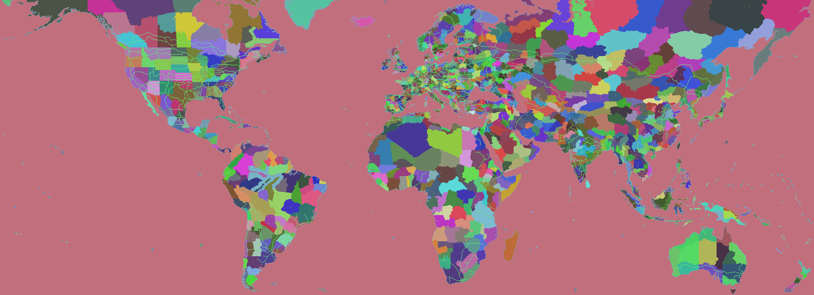
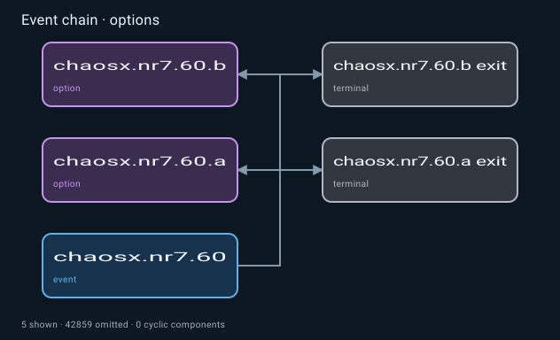

# Examples

Start with a task you would normally give your coding agent.
The agent chooses the MCP tools and opens the resulting images or source references.
The renders below use actual Chaos Redux and installed HOI4 files; use names from your own mod when trying the prompts.

## Find a rule without reading a whole wiki

> Find the installed documentation for `save_event_target_as`, read the relevant section, and show a vanilla usage. Keep the file and line references.

The reference tools find the section, read a small excerpt, and retain its source revision so the agent can return to it later.
In the [measured reference example](research/reference-benchmark.md), the search found the installed effect documentation first and a 12-line read supplied the command and supported scopes.
No wiki download or game launch was needed.

Use [Local references](reference.md) to configure an offline wiki snapshot or narrow a search.

## Review a large tree

> Render the mod's largest branching focus tree. Check its branch connections, alternative prerequisites, missing references and crowded areas before suggesting edits.

Open the image at full size for the complete layout.
This example contains 124 focuses in the recorded source version.
The [focus guide](focus.md) covers inspecting, rendering and reorganizing trees.

## Preview technology layouts and artwork

> Render the infantry technology folder using this mod and its installed game assets. Check card sizes, icons, prerequisite links and missing placements.

The preview follows the loaded technology and GUI definitions, including wide equipment cards.
The [technology comparisons](visual-comparisons.md#technology-folders) also show a mod folder with wide equipment cards rendered from a matching recorded source revision.
See the [technology guide](technology.md) for grants, bonuses and doctrine paths.

## Inspect an interface before editing it

> Find the Video options window in the installed interface files. Render it with labelled control regions, then check its text, spacing and clipping.

| Supplied in-game capture                                                  | MCP source preview                                                     |
| ------------------------------------------------------------------------- | ---------------------------------------------------------------------- |
|  |  |

For a mod window, ask for the same view at 100% and 125% UI scale and supply the state values needed by its controls.
Unknown state values must stay unresolved; a visible button alone does not establish that it is enabled in the game.
The [interface gallery](gui-comparisons.md) includes Škoda Priority, Chaos Redux Settings, Event Log, Chaos Meter, decisions and occupation views.

## Locate map data and plan an edit

> Find Brandenburg by name, show it on the map, and inspect its provinces, neighbours and railway connections. Show the affected files before changing anything.

After reviewing the selection, you can ask for a specific change such as moving named provinces into a state or updating a railway path.
The map tools check connected records and preserve dated state history when the operation can be represented safely.
See [Maps](map.md) for supported edits.

## Trace an event or compare AI weights

> Trace this event's options and follow-up events. Point out unresolved calls and link each route to its source.

> Compare this decision's `ai_will_do` score before and after my change in peace and war. List missing conditions separately from known results.

Use [Events](events.md) for route graphs and [AI analysis](probability.md) for supported weights, chances and timing models.
A decision score is not automatically a percentage chance of an AI click.

## About these examples

The images are source previews, not recordings of the server running the game.
Supplied game screenshots are identified separately and published with permission.
The [comparison pages](visual-comparisons.md) and [interface gallery](gui-comparisons.md) keep source details, reproducible inputs and known differences alongside the images.
The package does not include HOI4 or Chaos Redux source files or artwork.
