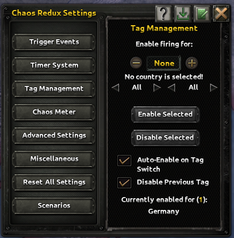
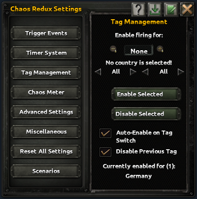
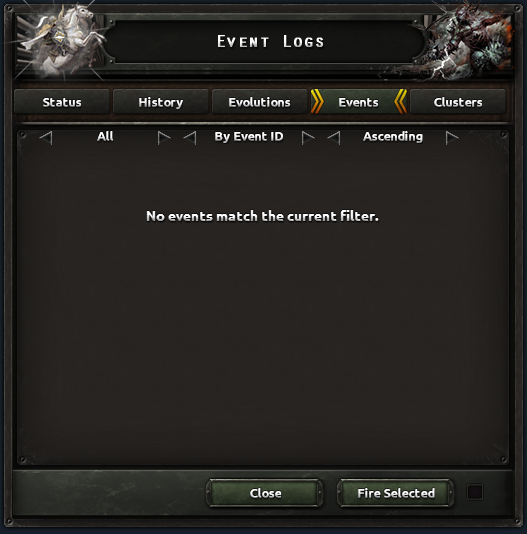
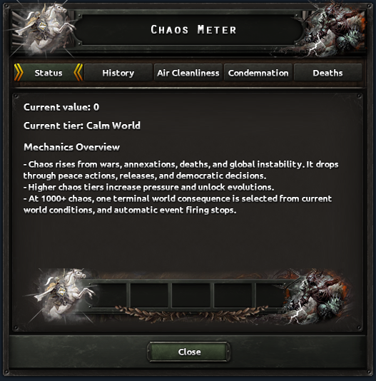
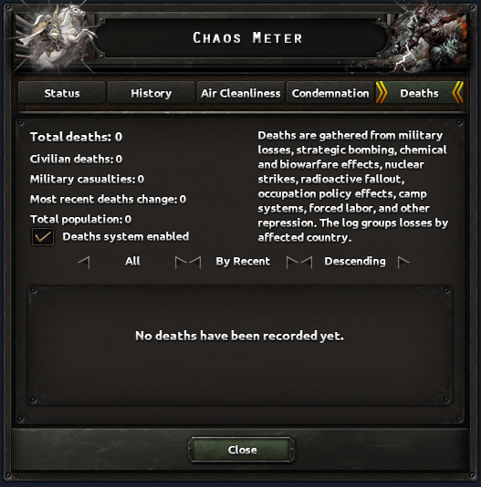
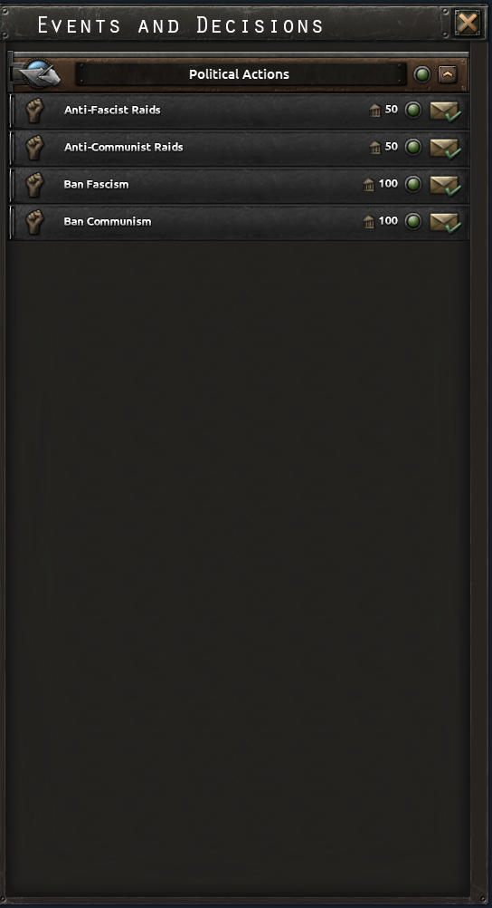
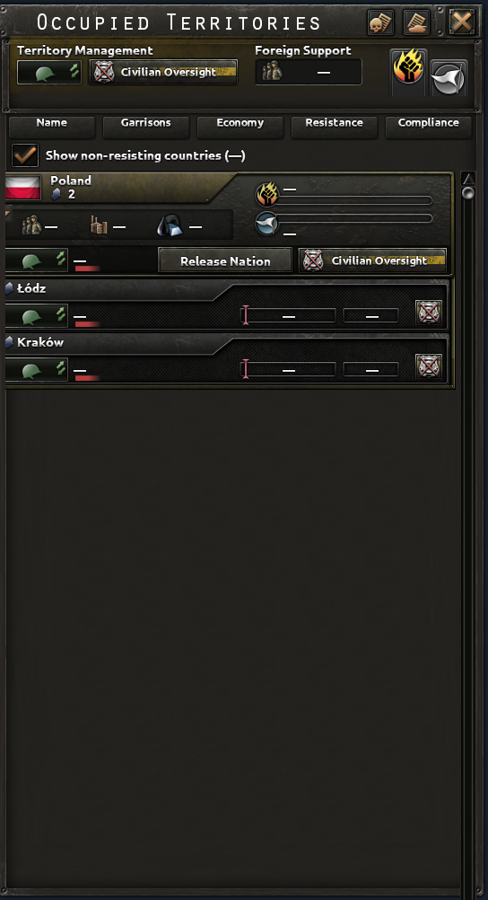

# Interface renders and evidence

These images use the production GUI renderer in `hoi4-agent-tools` 3.5.0, installed vanilla source, and the local Chaos Redux source.
The game screenshots were supplied by the user and are published unchanged with permission.
Game artwork belongs to its respective owners; this project is unaffiliated with Paradox Interactive.
The images remain outside the npm package.

Each reference is an unscaled crop of the full 1920×1080 output at UI scale 1.
The [manifest](images/comparisons/gui/manifest.json) records exact scenarios, source revisions, renderer implementation hashes, PNG hashes, diagnostics, and fidelity limitations.
The complete full-window PNG accompanies each crop.
An offline render does not execute clicks, native tooltips, transfers, or engine timers.

## Supplied game comparisons

| View                    | In game                                                               | MCP renderer                                                      |
| ----------------------- | --------------------------------------------------------------------- | ----------------------------------------------------------------- |
| Options Video           |    |    |
| Škoda Priority          |     |     |
| Chaos Redux Tag Manager |  |  |

Options and Škoda use the selection and values visible in their captures.
The Options gamma value is unavailable, so its neutral knob position is not a matched engine setting.
The Škoda inlay uses its full source-defined 552×516 background; the game's embedding and capture framing differ.
The Tag Manager capture predates the current source's +5/−5 controls and wider action buttons.
These differences prevent a whole-image accuracy percentage.

## General-system source views

| Event Log, empty Events tab                            | Chaos Meter, Status                                                      | Chaos Meter, Deaths                                                      |
| ------------------------------------------------------ | ------------------------------------------------------------------------ | ------------------------------------------------------------------------ |
|  |  |  |

These views use their current source definitions and declared initial zero/empty states.
They have no matched game capture and do not represent an observed campaign.
Native compound controls can generate overlap diagnostics; unsupported or approximated behavior remains visible in the manifest instead of being counted as a passed engine check.

## Populated native templates

| Vanilla decisions                                                                                    | Vanilla occupation                                                                                       |
| ---------------------------------------------------------------------------------------------------- | -------------------------------------------------------------------------------------------------------- |
|  |  |

The [decision fixture](images/comparisons/native-ui/decisions-scenario.json) uses the installed political category and four actual decisions, their icons, names, and source costs.
It is a source catalogue, not an assertion that all four are simultaneously available in one campaign.
The [occupation fixture](images/comparisons/native-ui/occupation-scenario.json) uses the installed Polish country and state templates with declared control of states 87 and 88.
Its two entries are declared layout inputs; unavailable campaign quantities are shown as dashes.
Only the release-nation button is displayed as a declared native action state; its engine availability is not evaluated.
Native controllers can supply dimensions and text that are absent from static GUI files; the fixture records those inputs explicitly.

The [decisions manifest](images/comparisons/native-ui/countrydecisionview-manifest.json) and [occupation manifest](images/comparisons/native-ui/countryoccupationview-manifest.json) retain full source, control, and fidelity evidence.
The occupation title uses the renderer's minimum-one-font-line convention for an inferred `maxHeight` smaller than its font line.
This is reported as approximated fidelity, because there is no matching engine capture for that convention.
No engine-equivalence claim follows from these populated images.

## Reproduction

Use `npx tsx scripts/render-vanilla-ui-reference.ts GAME_ROOT WINDOW SCENARIO_JSON OUTPUT_DIRECTORY [MOD_ROOT]` from the source checkout for an individual reference.
Omit `MOD_ROOT` for installed vanilla.
Use each manifest's exact scenario as `SCENARIO_JSON`; the production service receives it with generated scenarios disabled.
The source script writes full, window-cropped, annotated, click-region, and source-map images with provenance.
Review the rendered pixels as well as the diagnostic and fidelity records before accepting a reference.
