# Interface examples

These previews use actual vanilla and mod interface files, artwork and fonts.
Supplied in-game screenshots appear beside the MCP results where available.

## Compare with the game

| View                   | In game                                                                     | MCP preview                                                              |
| ---------------------- | --------------------------------------------------------------------------- | ------------------------------------------------------------------------ |
| Vanilla video options  | 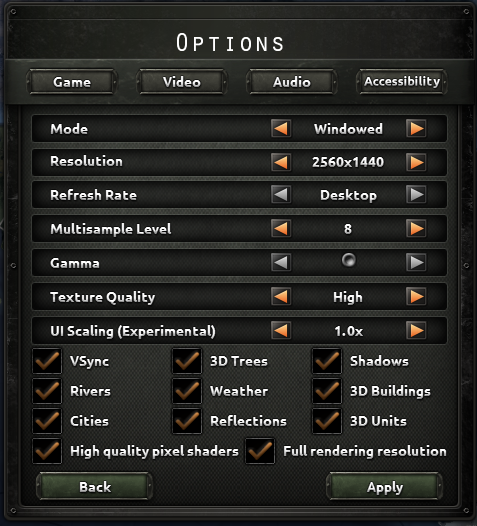         | 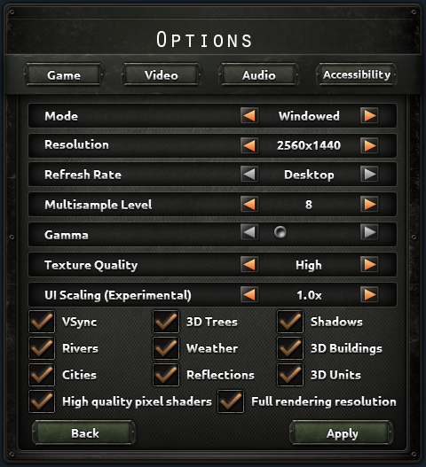         |
| Vanilla priority panel | 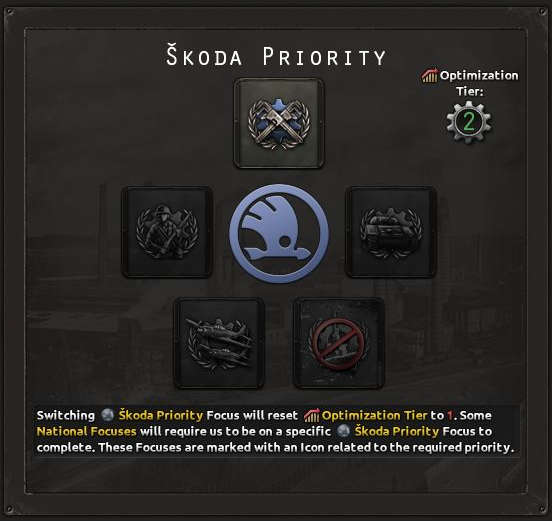 | 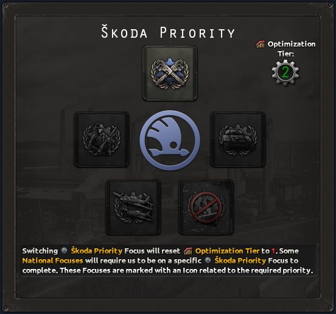 |
| Mod management window  | 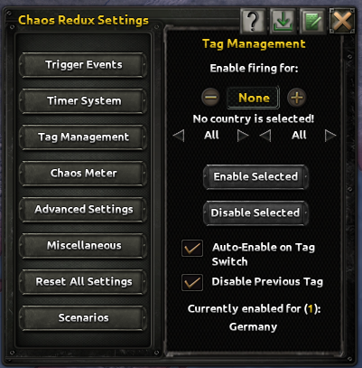 | 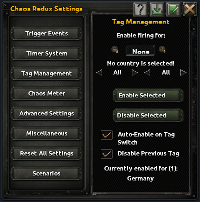 |

The Options preview uses the captured values except gamma, whose value is unknown.
The priority panel's full source background and the game's capture framing differ.
The management window screenshot uses an older layout than the loaded source, which has +5/−5 controls and wider buttons.
These differences prevent a whole-image accuracy percentage.

## Other interfaces

| Mod event log                                              | Mod status panel                                                       | Mod status panel, second tab                                                       |
| ---------------------------------------------------------- | ---------------------------------------------------------------------- | ---------------------------------------------------------------------------------- |
| 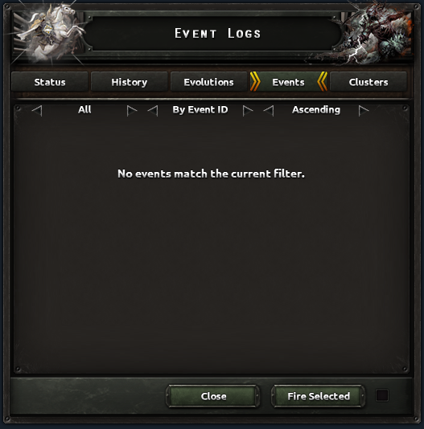 | 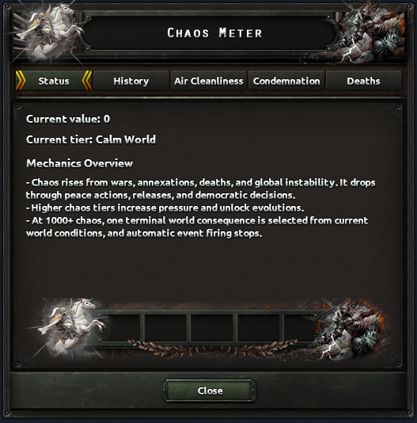 | 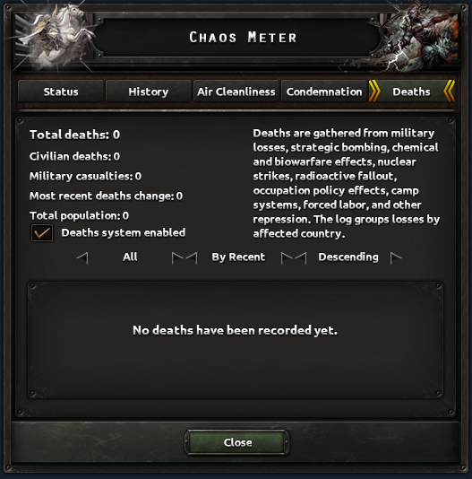 |

These views use declared empty or zero states for layout review.
They are not captures from an observed campaign.

## Vanilla decisions and occupation

| Decisions                                                                                  | Occupation                                                                                     |
| ------------------------------------------------------------------------------------------ | ---------------------------------------------------------------------------------------------- |
| 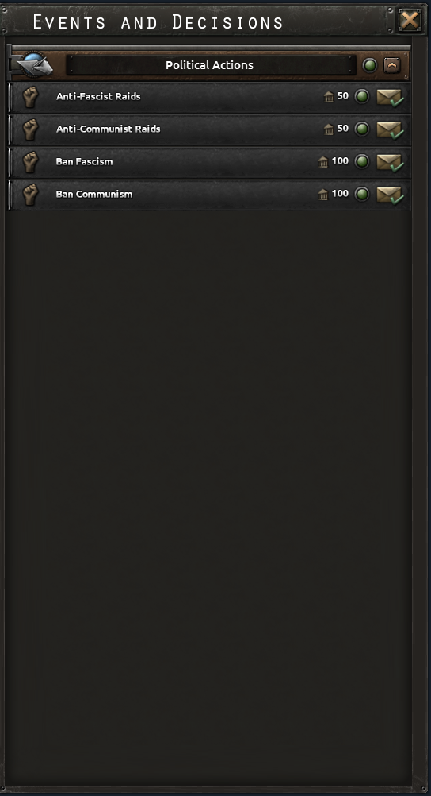 | 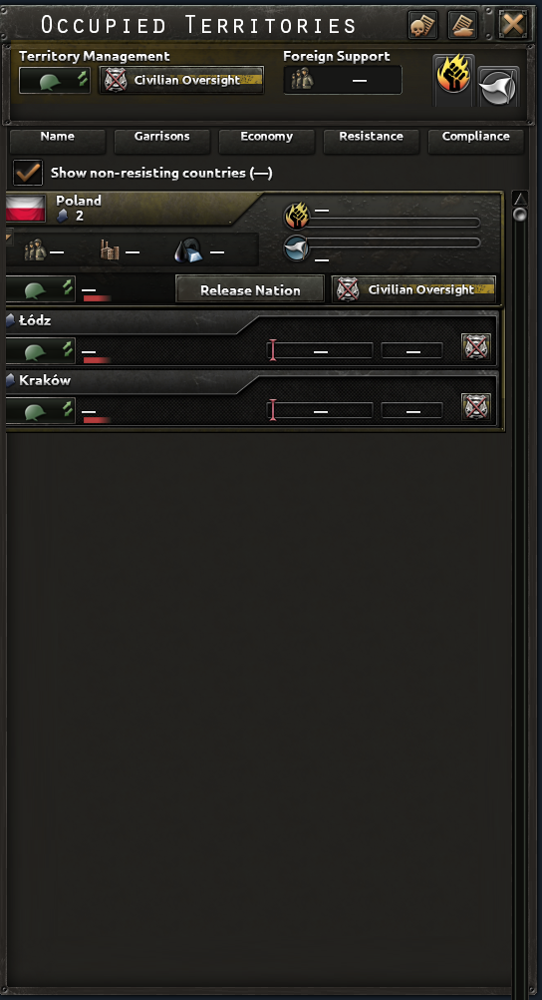 |

The decision example uses four real decisions with their source icons, names and costs; it does not assert that all four are available together.
The occupation example uses real Polish country and state templates with declared control of states 87 and 88, and dashes for unavailable campaign quantities.
The displayed release action is a declared preview state, not proof of in-game availability.

## Try it on your mod

> Render this window at 100% and 125% UI scale. Show the control regions and list any missing state inputs, clipped text or overlaps.

Use the [GUI guide](gui.md) for scenario inputs and the [examples guide](examples.md) for other tasks.
Offline previews do not execute native clicks, tooltip timing or engine effects.

<details>
<summary>Source details and reproduction</summary>

The images were produced by the production GUI renderer in 3.5.0.
On 4 October 2026 the 3.7.0 renderer reproduced every full-window PNG, including the decision and occupation views, byte for byte from the recorded scenarios.
Each general-system crop is unscaled from the full 1920×1080 output at UI scale 1.
Its full-window PNG accompanies the crop.
The [GUI manifest](images/comparisons/gui/manifest.json) records exact scenarios, source revisions, implementation and PNG hashes, diagnostics and fidelity limits.

The [decisions scenario](images/comparisons/native-ui/decisions-scenario.json) and [occupation scenario](images/comparisons/native-ui/occupation-scenario.json) declare the native fields used by those examples.
The [decisions manifest](images/comparisons/native-ui/countrydecisionview-manifest.json) and [occupation manifest](images/comparisons/native-ui/countryoccupationview-manifest.json) retain their source and fidelity evidence.
Native controllers can supply dimensions and text absent from static GUI files.
The occupation title's minimum-one-font-line convention is classified as approximated because no matching game capture verifies it.

From a source checkout, run:

```text
npx tsx scripts/render-vanilla-ui-reference.ts GAME_ROOT WINDOW SCENARIO_JSON OUTPUT_DIRECTORY [MOD_ROOT]
```

Omit `MOD_ROOT` for vanilla and use the exact scenario from the relevant manifest.
The script writes full, cropped, annotated, click-region and source-map images.
Inspect the pixels and the diagnostic/fidelity records before accepting a preview.

The user supplied the in-game screenshots and approved their unchanged publication.
Game artwork belongs to its respective owners, is not covered by the code license, and is excluded from the npm package.
This project is unaffiliated with Paradox Interactive.

</details>
