# Game captures and MCP render comparisons

These are real user-supplied Hearts of Iron IV captures and MCP renders from the active Chaos Redux source and installed game assets. The images are published with the user's permission for comparison only and are not covered by this repository's Apache-2.0 code license. Game imagery belongs to Paradox Interactive; Chaos Redux material belongs to its respective creators. The captures and renders are not included in the npm package. The [render manifest](images/comparisons/manifest.json) records the tool version, source revisions, tree and folder coverage, item layouts, and sprite coverage. The captures were supplied in September 2026; the renders were regenerated from source available on 25–26 September 2026. The screenshots do not include zoom, viewport, country, research state, or enabled-DLC metadata, so differences cannot all be attributed to the renderer.

## Focus trees

| In game                                                                      | MCP render                                                                   |
| ---------------------------------------------------------------------------- | ---------------------------------------------------------------------------- |
| 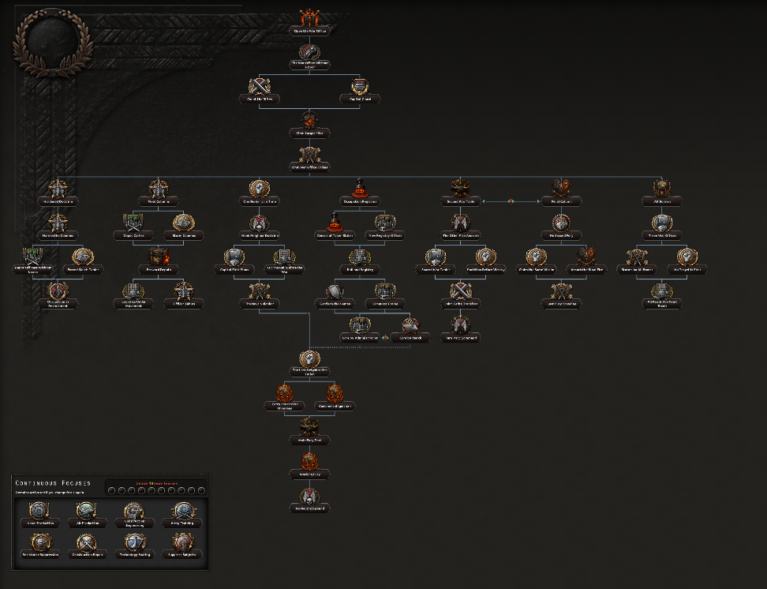               | 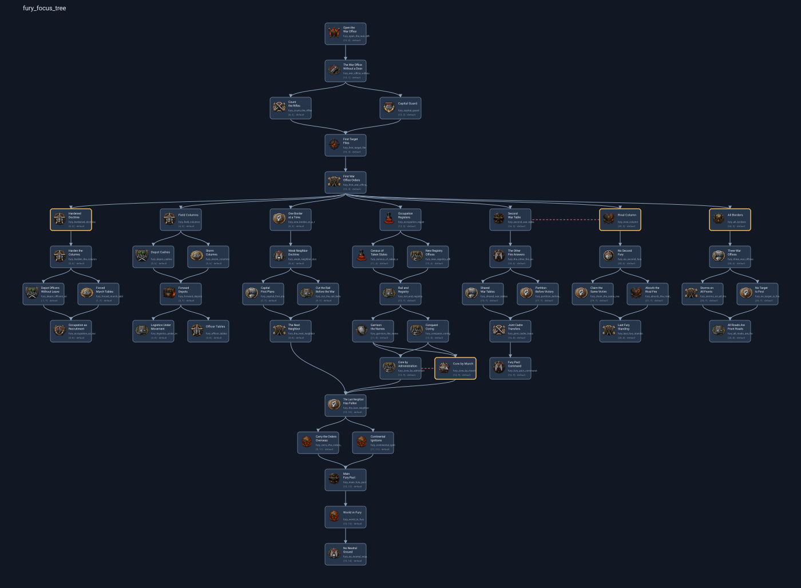               |
| 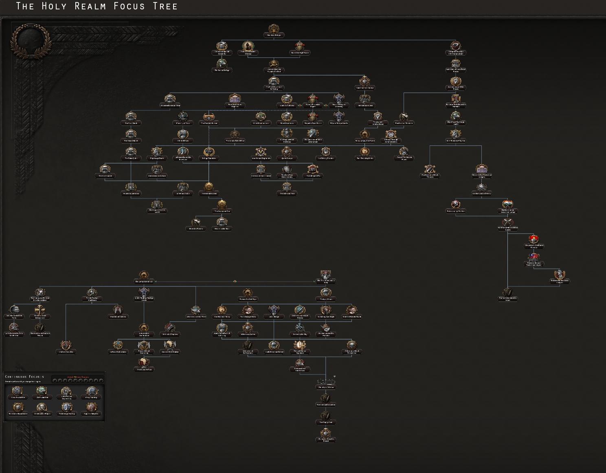   | 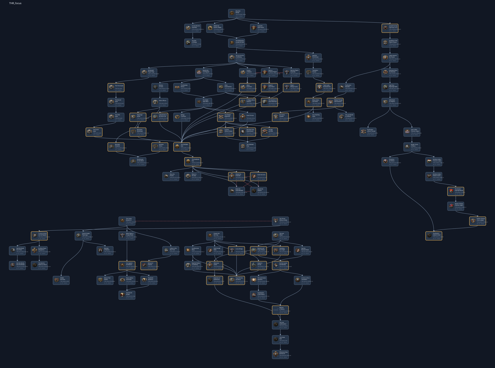   |
| 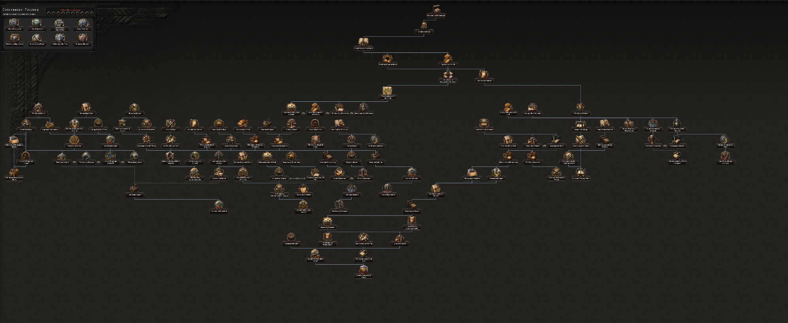 | 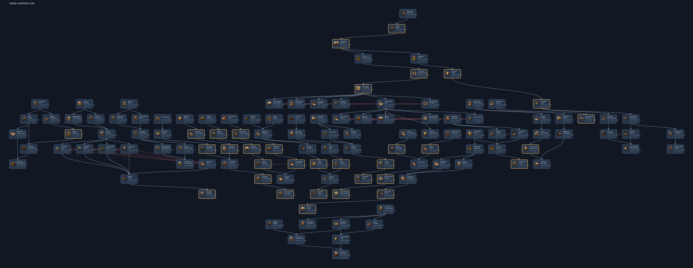 |

The three source trees contain 52 Fury, 111 Holy Realm, and 124 Utopia Manifesto focuses in the reviewed revision. The MCP review uses 96-pixel horizontal and 130-pixel vertical spacing. The broad branch arrangements are comparable, but the game's standalone icons, dark labels, decorative frame, continuous-focus panel, and orthogonal connector treatment differ visibly from the MCP's small blue cards and links. These focus renders are useful for structure and route review; they are not pixel replicas.

## Technology folders

| In game                                                                               | MCP render                                                                            |
| ------------------------------------------------------------------------------------- | ------------------------------------------------------------------------------------- |
| 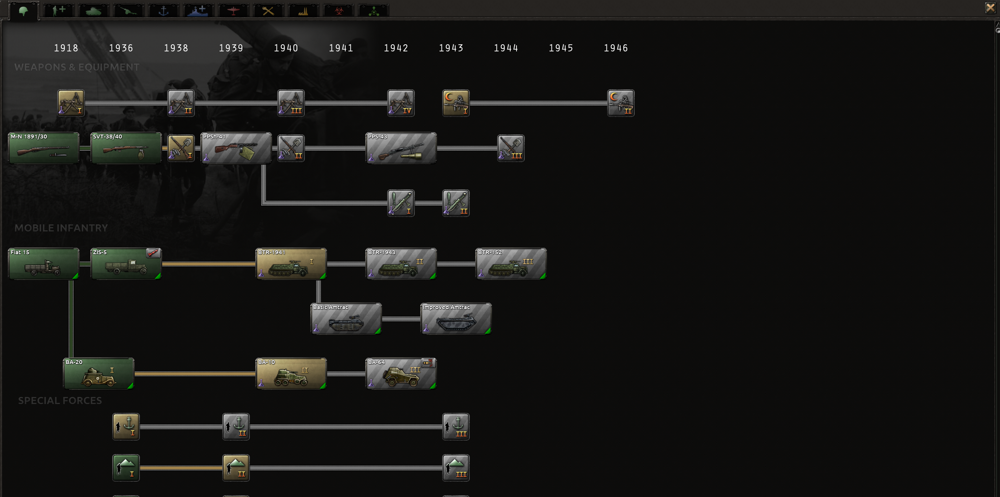         | 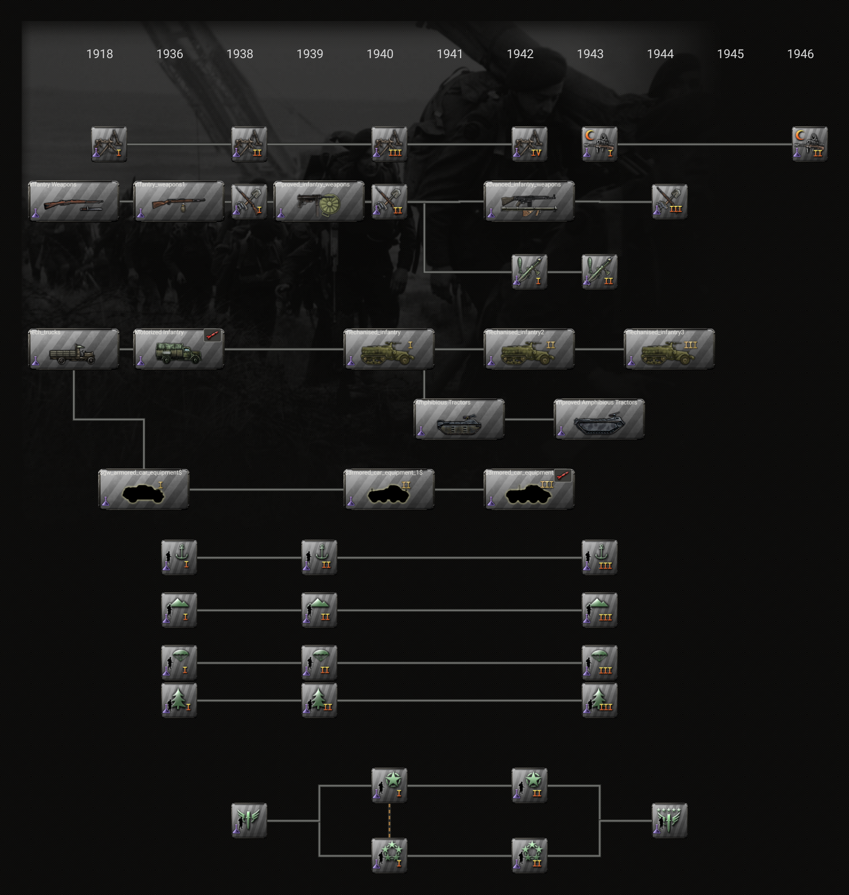         |
| 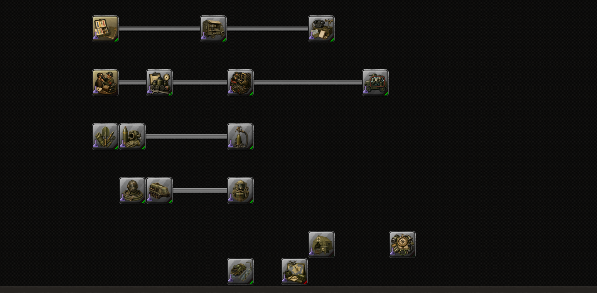 | 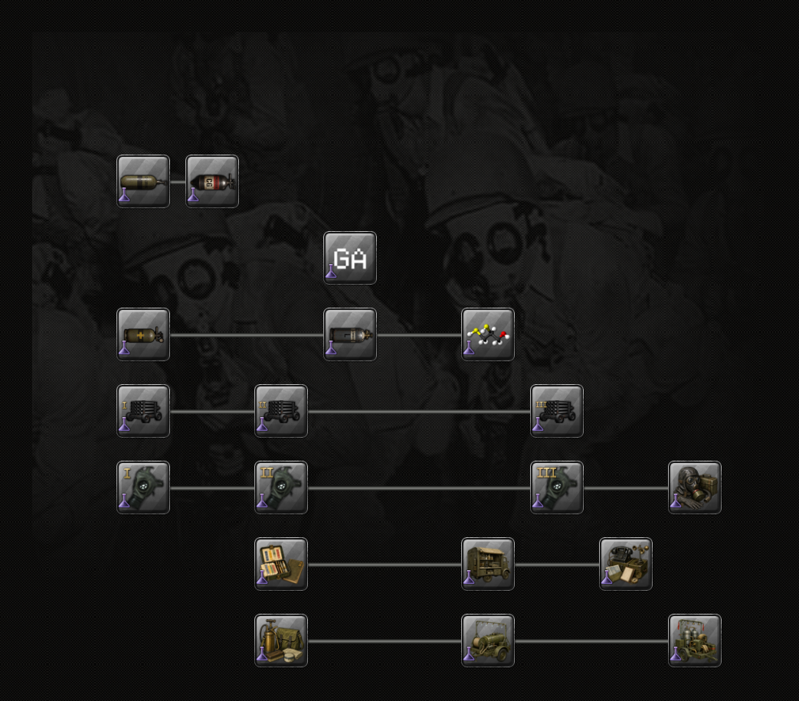 |

The current infantry render contains 43 nodes: 29 small and 14 wide items. It resolves all 50 requested sprites with no omitted nodes. The current chemical render contains 19 square items and resolves all 25 requested sprites with no omissions. The supplied chemical captures cannot validate that render as an in-game visual match: the recent full-folder capture plainly shows wide cylinder and projector cards, while the current-source MCP render makes them square.

The recent capture's visible layout matches the historical Chaos Redux technology and GUI definitions at revision `4efc01fc87f1137e98c864f928dd5603e6b7d2f1`: Phosgene is stacked below Chlorine, Sarin and Soman have folder placements, and the GUI has year headings through 1946. The current source instead places Phosgene beside Chlorine, omits Sarin and Soman folder placements, and defines fewer year headings. These are source differences that prevent a like-for-like current-source comparison; the date of the capture does not establish which source revision the game loaded. The current source also declares `force_use_small_tech_layout = yes` on the equipment technologies. The renderer follows that declaration. This does not resolve the observed mismatch with the supplied in-game capture.

The historical render uses the exact technology and research-GUI files from that commit over the currently installed remaining mod and game assets. It contains 30 placed technologies, including all nine wide equipment cards visible in the capture and 21 small cards; no requested sprite is unresolved. The renderer uses native sprite dimensions and GUI icon anchors for wide cards: the Chlorine and Phosgene cylinder textures are 131×52, not 70×70. Small cards retain their bounded icon viewport. The matching wide-card geometry and full-size artwork address the small-icon defect in the earlier render. This is not full visual parity: its card labels use technology names rather than the game's equipment names, its default research state makes every card gray instead of the captured green/gold/striped mix, and it omits some section text, tabs, and other framing. Those are remaining presentation differences, not evidence of 99.9% accuracy.

| Recently supplied in-game chemical folder                                                | Source-matched historical MCP render                                                                                |
| ---------------------------------------------------------------------------------------- | ------------------------------------------------------------------------------------------------------------------- |
| 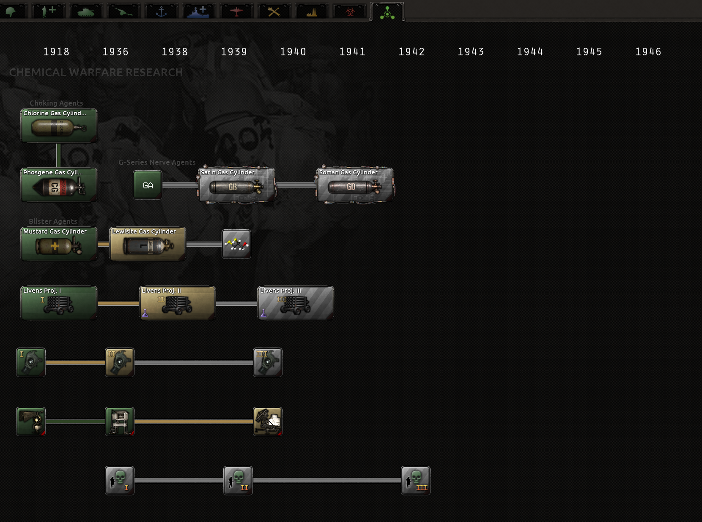 | 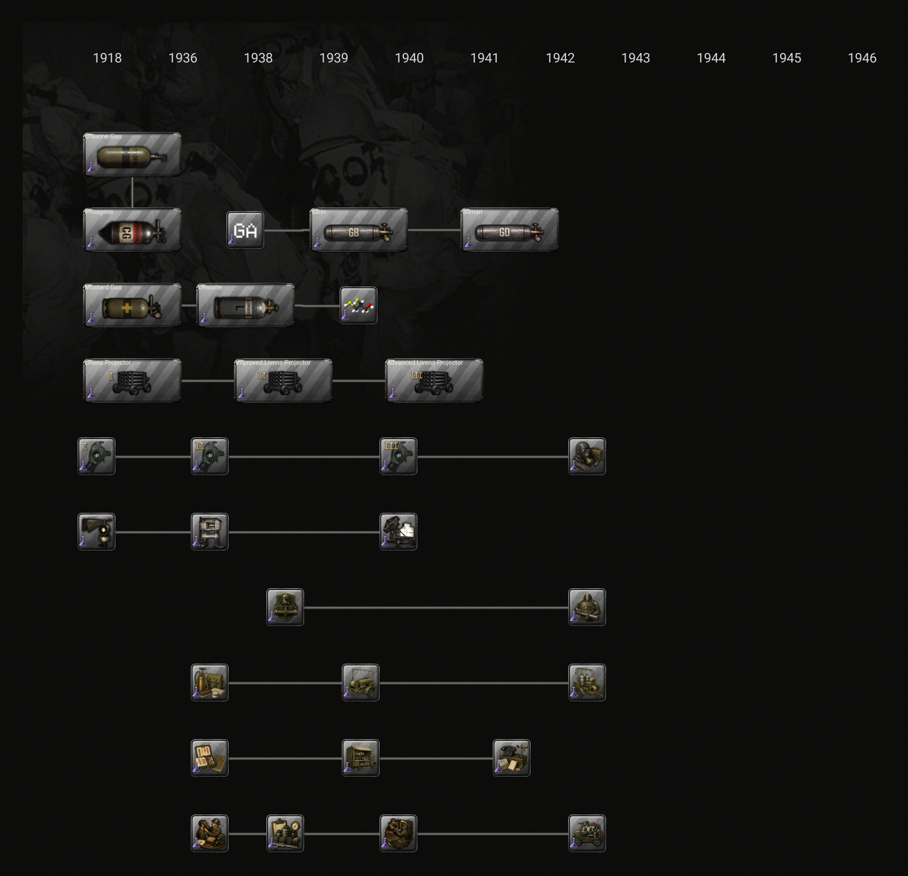 |

The Chlorine and Phosgene crops below preserve the pixels from those two images. They show the wide card and cylinder art at their rendered sizes.

| In-game wide cards                                                                        | Source-matched MCP wide cards                                                                                        |
| ----------------------------------------------------------------------------------------- | -------------------------------------------------------------------------------------------------------------------- |
| 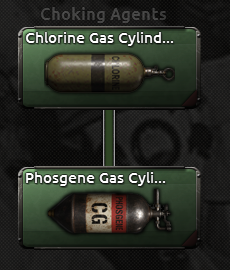 | 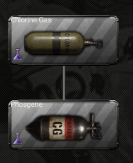 |

| In-game chemical cards                                                              | Native-size crop of current MCP render                                                                        |
| ----------------------------------------------------------------------------------- | ------------------------------------------------------------------------------------------------------------- |
| 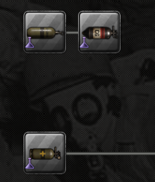 | 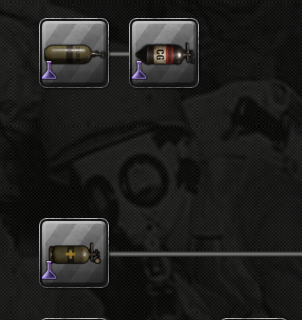 |

These three 70×70 chemical card interiors correlate with the regenerated square-card MCP output at 0.999548, 0.998830, and 0.999481 in normalized grayscale without resizing. They measure only the artwork inside the supplied square-card crop; they do not validate the wide cards, the entire folder, or the current game presentation.

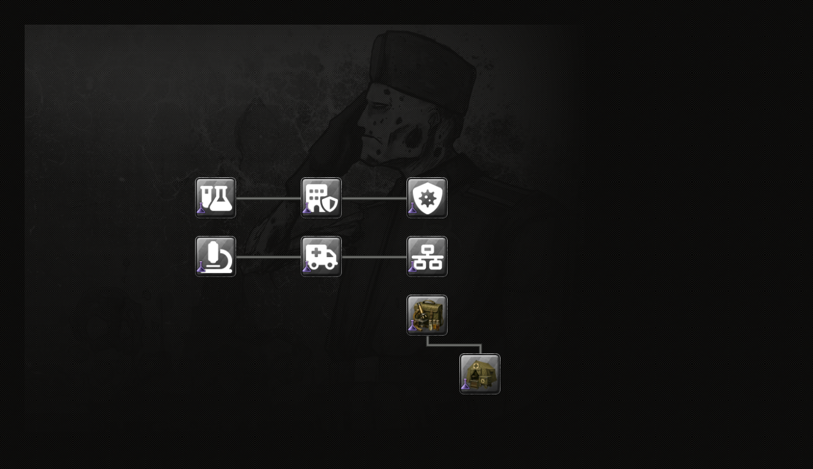

The current biological folder contains 8 square items, resolves all 14 requested sprites, and omits no nodes. There is no supplied full biological folder screenshot. The [supplied historical biological card crop](images/comparisons/biological-cards-ingame.png) shows four bomb technologies absent from the current folder; their current source definitions have no folder placement and are marked as special-project unlocks. An older local development render did show those four bomb cards, but it is not a current-release folder comparison. Its four native-size card-interior correlations ranged from 0.998712 to 0.999589. Do not apply those historical scores to the current biological folder.

Neither the focus nor the technology evidence supports a **99.9% whole-image accuracy** claim. Source placement, sprite resolution, and sampled-card similarity are separate measures. In-game visual acceptance remains a user-side check.

## Regenerating the renders

Set `HOI4_GAME_ROOT` to an installed Hearts of Iron IV directory and `HOI4_EXTERNAL_MOD_ROOT` to the Chaos Redux checkout, then run `npm run docs:comparison-examples`. The historical chemical comparison also requires commit `4efc01fc87f1137e98c864f928dd5603e6b7d2f1` in that checkout. The command reads the checked-in user captures and writes MCP renders, crops, and the source manifest under `docs/images/comparisons/`.
