# Focus and technology examples

Compare supplied in-game captures with MCP previews from real Chaos Redux and installed HOI4 files.
Focus previews help review structure and routes; they do not reproduce the game's entire focus-screen styling.
Technology previews follow the loaded source's card layouts and artwork.

## Focus trees

| In game                                                           | MCP preview                                                    |
| ----------------------------------------------------------------- | -------------------------------------------------------------- |
| 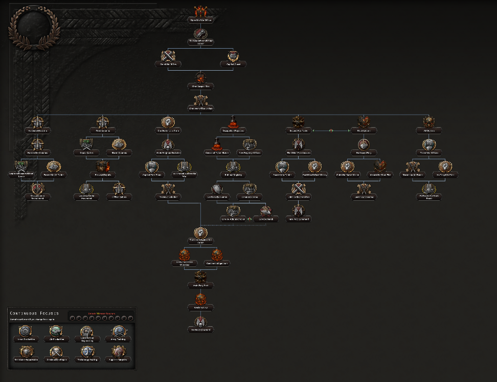               | 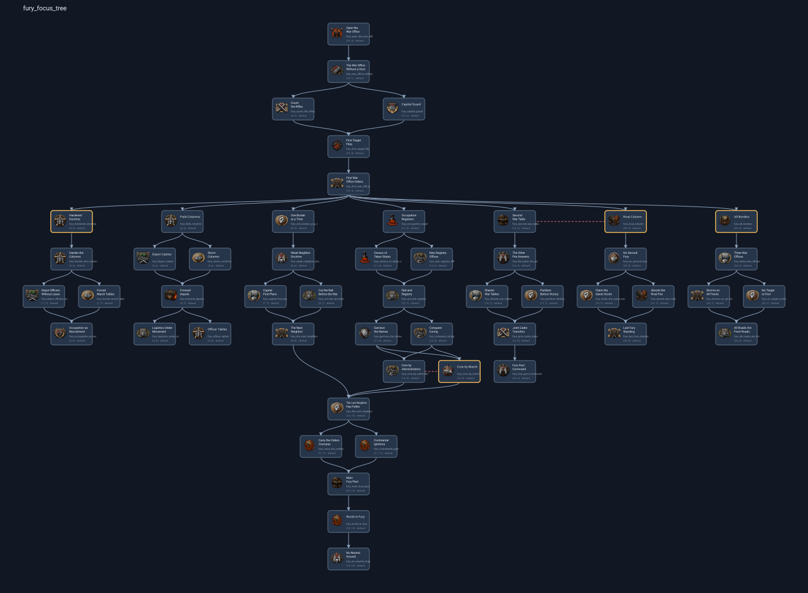               |
| 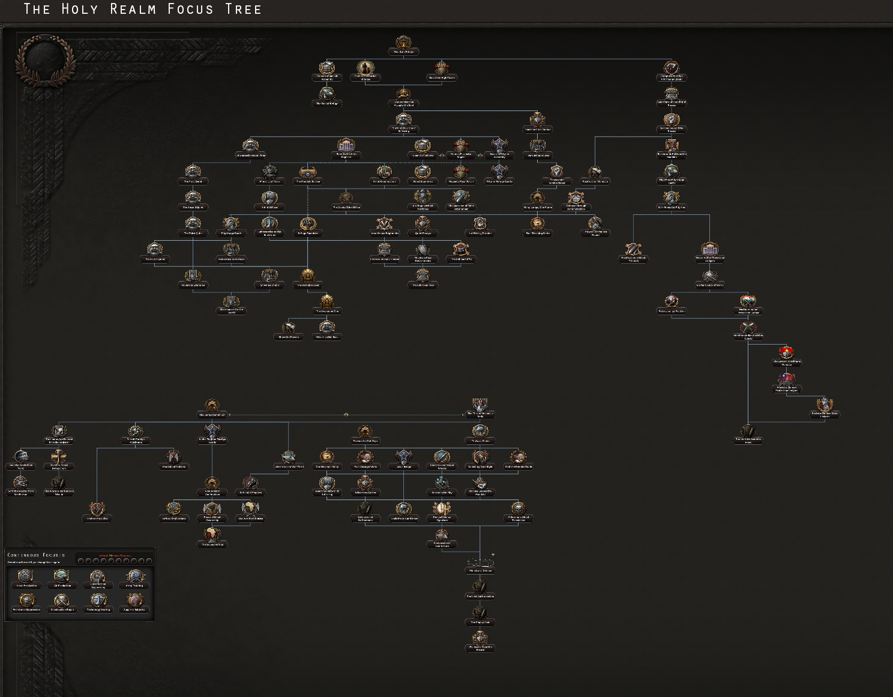   | 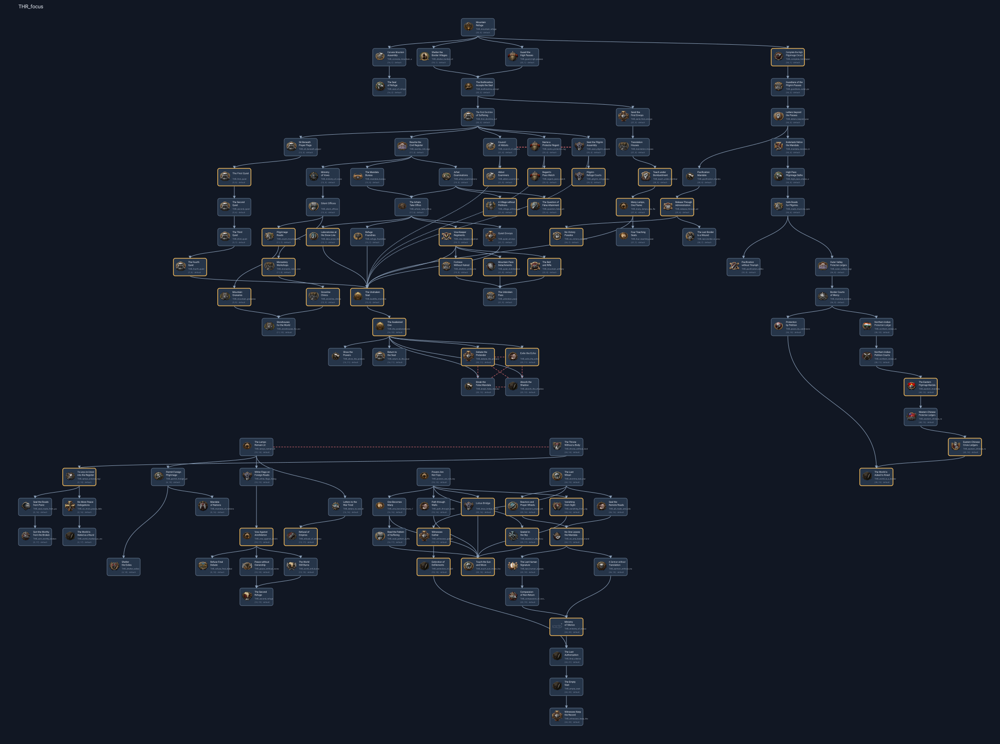   |
| 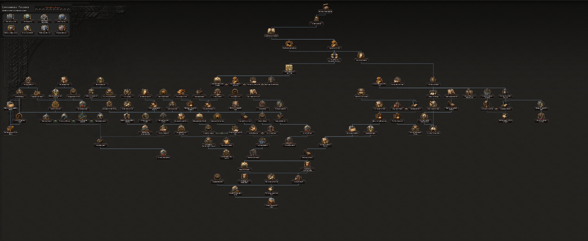 | 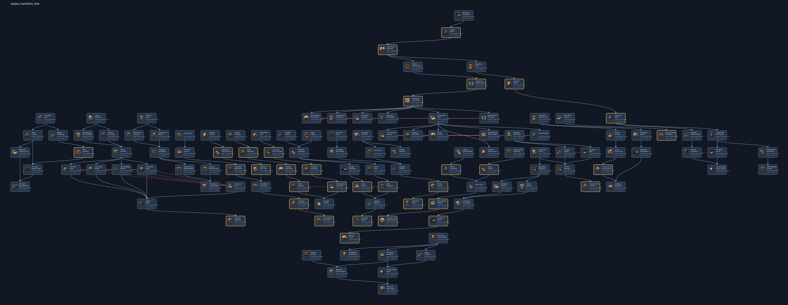 |

The recorded trees contain 52 Fury, 111 Holy Realm and 124 Utopia Manifesto focuses.
The MCP uses cards and curved connectors for structural review, while the game uses its own icons, labels, frame and continuous-focus panel.

### Alternative prerequisites

| In-game Fury branch                                                         | MCP preview                                                             |
| --------------------------------------------------------------------------- | ----------------------------------------------------------------------- |
| 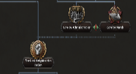 | 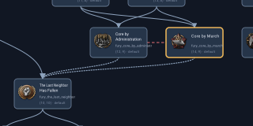 |

The branch leading to “The Last Neighbor Has Fallen” has two alternatives.
Dotted connectors mark the alternatives; separately required prerequisites remain solid.

## Technology folders

| In game                                                             | MCP preview                                                                     |
| ------------------------------------------------------------------- | ------------------------------------------------------------------------------- |
| 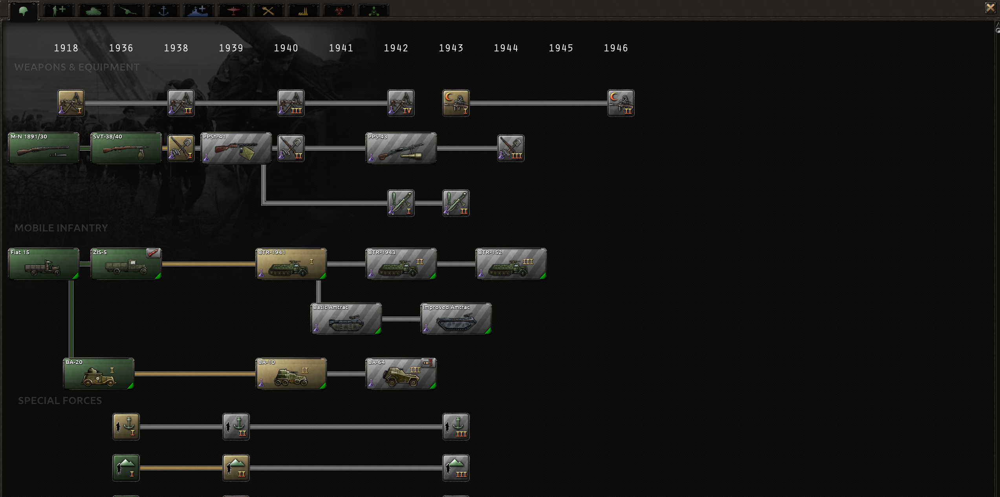         | 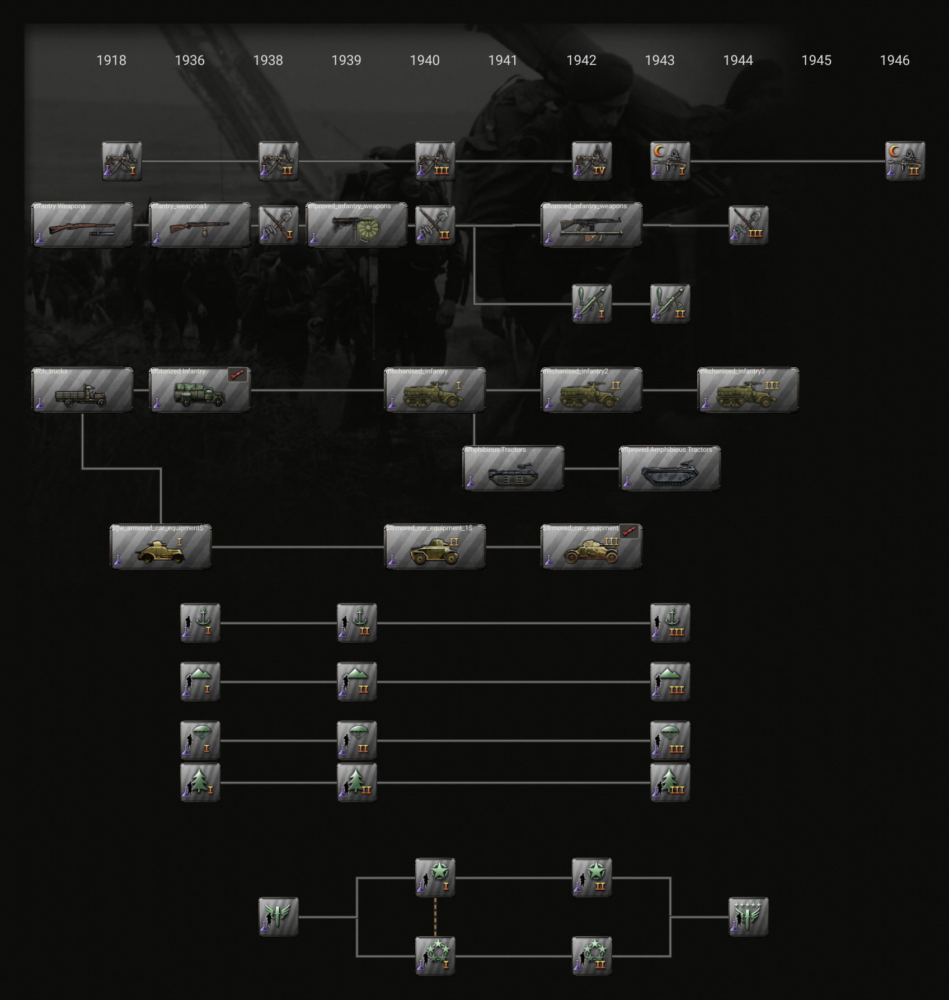                        |
| 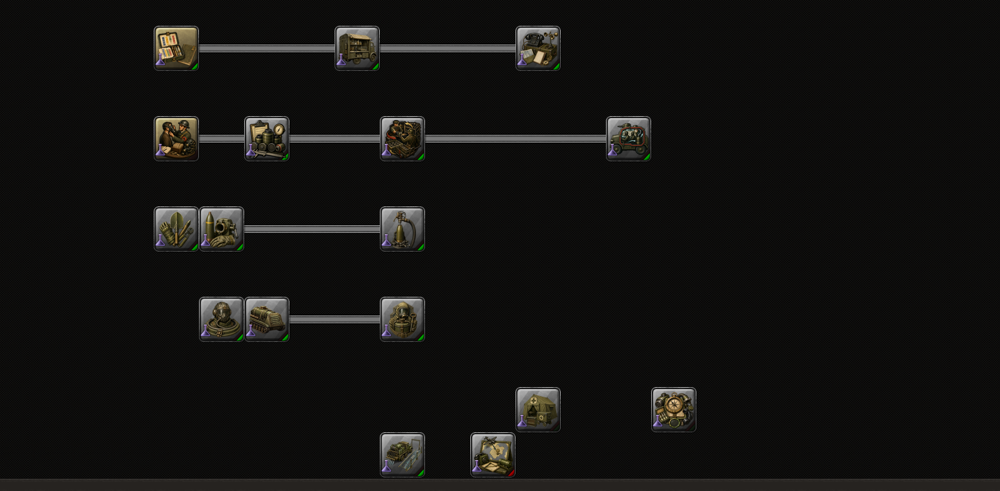 | 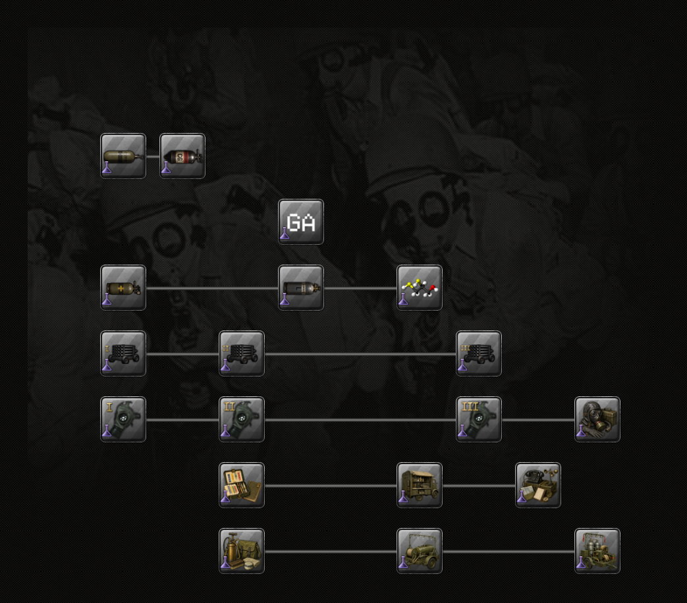 |

The infantry example resolves all 43 nodes, including 14 wide equipment cards.
The current chemical source forces square cards and has different placements from the supplied game capture.
That source difference must not be mistaken for a matched in-game comparison.

### Wide cards from the matching source version

| Supplied chemical-folder capture                                          | Matching historical-source preview                                                    |
| ------------------------------------------------------------------------- | ------------------------------------------------------------------------------------- |
| 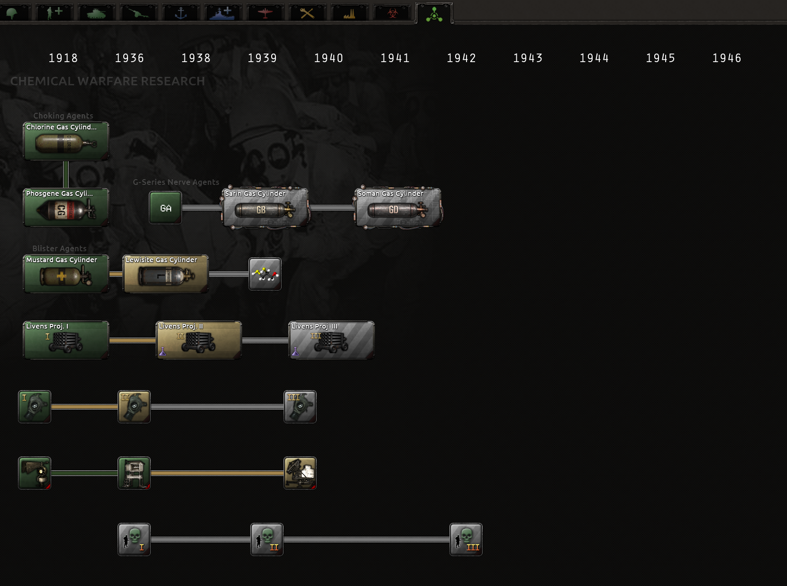 | 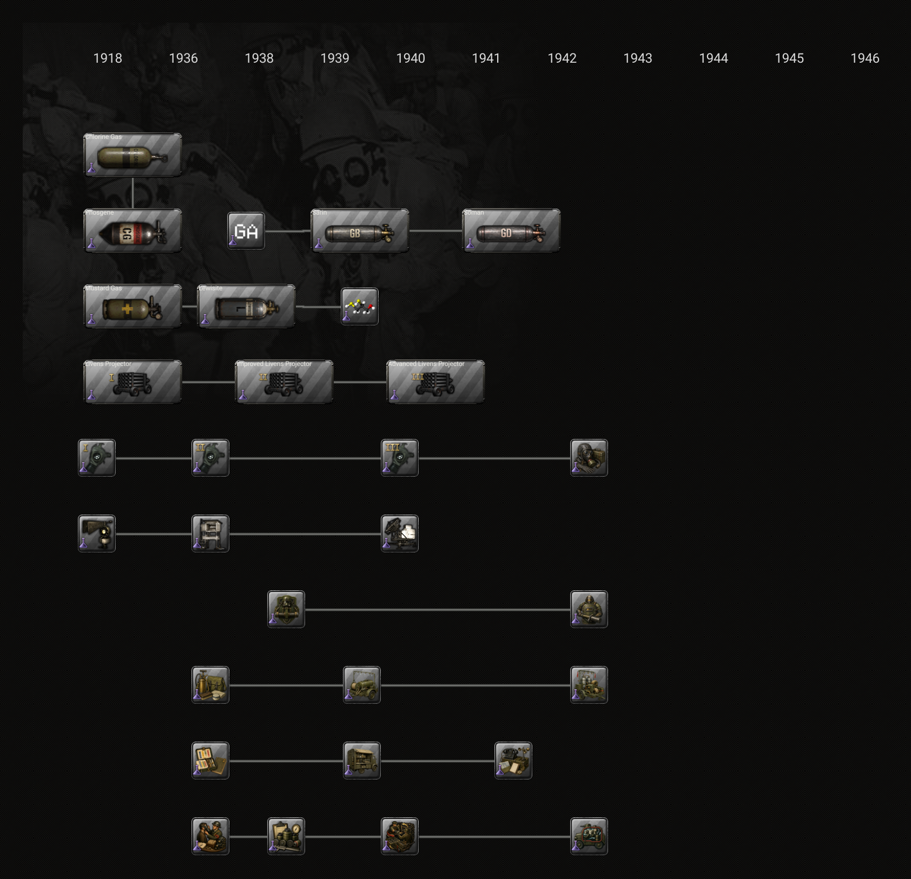 |

| In-game wide cards                                                                | MCP wide cards                                                                       |
| --------------------------------------------------------------------------------- | ------------------------------------------------------------------------------------ |
| 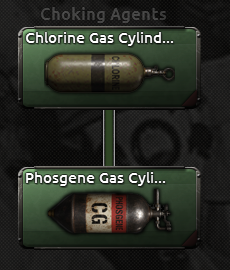 | 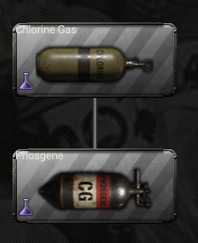 |

The matching source version produces all nine wide equipment cards visible in the capture.
Their cylinder artwork uses its native 131×52 size rather than being squeezed into a square icon area.
Names, research-state colors and surrounding interface text still differ, so this is not whole-image parity.

### Biological folder

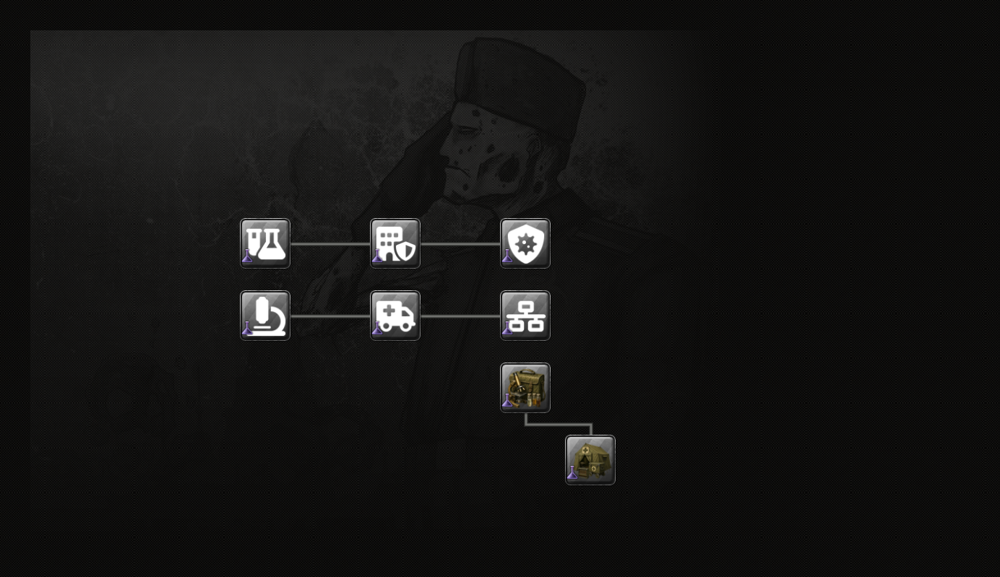

The current folder contains eight square items with no missing nodes or requested sprites.
There is no matching full-folder game capture.
The four bomb cards in the [supplied crop](images/comparisons/biological-cards-ingame.png) belong to a different source layout; their current definitions use special-project unlocks without folder placements.

## What these comparisons establish

They demonstrate real source layouts, resolved artwork, wide-card sizing and dotted alternative links.
They do not establish 99.9% whole-image accuracy or prove runtime state.
Use the [examples guide](examples.md) for practical prompts and the [interface gallery](gui-comparisons.md) for GUI previews.

Measurements, source versions and reproduction

The [manifest](images/comparisons/manifest.json) records tool version, source revisions, folder/tree coverage, layouts and sprite resolution.
Captures were supplied in September 2026 and renders use source available on 25–26 September 2026.
The captures lack complete zoom, viewport, country, research-state and DLC metadata.

The focus previews use 96-pixel horizontal and 130-pixel vertical spacing.
Fury, Holy Realm and Utopia contain 1, 1 and 5 alternative prerequisite groups in the recorded source.

Infantry resolves 50 requested sprites across 29 small and 14 wide items.
The current chemical folder has 19 square items and resolves 25 requested sprites without omissions.
The supplied wide-card capture matches technology and research-GUI definitions at Chaos Redux revision `4efc01fc87f1137e98c864f928dd5603e6b7d2f1`.
That version stacks Phosgene below Chlorine, includes Sarin/Soman folder placements, and has year headings through 1946.
The current source places Phosgene beside Chlorine, lacks those two placements, has fewer year headings, and sets `force_use_small_tech_layout = yes`.

The historical preview uses that revision's technology and research-GUI files over the other currently installed assets.
It contains 30 placed technologies: nine wide and 21 small, with no unresolved requested sprites.
Its labels use technology names rather than equipment names, its declared research state produces gray cards, and some section text/tabs/framing are absent.

The three supplied square-card interiors correlate with the corresponding MCP crops at 0.999548, 0.998830 and 0.999481 in normalized grayscale without resizing.
Those scores describe only the 70×70 interiors shown below, not wide cards or a complete folder.

| Supplied square-card crop                                                      | MCP square-card crop                                                       |
| ------------------------------------------------------------------------------ | -------------------------------------------------------------------------- |
| 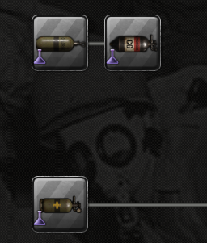 | 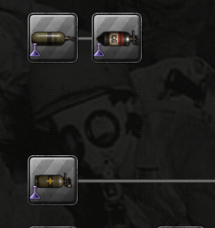 |

The current biological folder resolves all 14 requested sprites.
An older local render of the four historical bomb cards had interior correlations of 0.998712–0.999589; those scores do not validate the current folder.

To reproduce, set `HOI4_GAME_ROOT` and `HOI4_EXTERNAL_MOD_ROOT`, then run `npm run docs:comparison-examples`.
The historical chemical comparison also requires the pinned commit in the mod checkout.
The command reads the checked-in captures and writes renders, crops and the manifest.

Images are published with permission for comparison, are excluded from the npm package, and are not covered by the repository's Apache-2.0 code license.
Game imagery belongs to Paradox Interactive and mod material to its respective creators.

